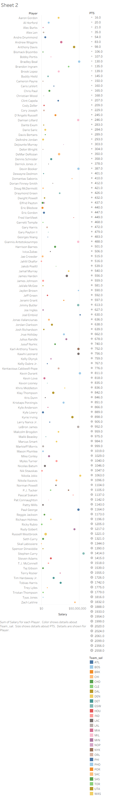

# NBA-Salary-Performance-Dashboard
NBA Statistics shown amongst different perspectives

This project analyzes the 2024-25 NBA season player salaries vs performance using Python(pandas) for data cleaning and Tableau for visualization.
This highlights undervalued players, overpriced contracts, and team/position value trends.

Data sources
- [NBA Player Salaries 2024-25 (Kaggle) - https://www.kaggle.com/datasets/ratin21/nba-player-salaries-2024-25 ]
- [NBA Player Stats (Kaggle) - https://www.kaggle.com/datasets/drgilermo/nba-players-stats ]

Preprocessing (Python)
- Cleaned and merged salary + stats data
- Engineered 'Efficiency' Metric
- Created 'Salary_per_Efficiency' ROI metric
- Output: 'nba_salary-performance_2024.csv

Visualization (Tableau)
KPI Cards: AVG Salary, AVG Efficiency, Best Value Player, Worst Value Player

**Live Dashboard**
[View on Tableau Public](https://public.tableau.com/views/NBA-Salary-Performance-Dashboard-2024-25/Dashboard1)

Scatter Plot: Salary vs Efficiency (bubble size = TS, color = Team)
Top 10 Bar Chart: Best Value players

Team leaderboard: AVG ROI per team

Heatmap: ROI by Team x Position

Interactive Filters: Selecting a team/player updates all views

Insights:
- The average NBA salary in 2024-25 is $15.3 Million
- Identified undervalued players devlivering top perfomance at low cost
- Highlighted teams/positions that are overspending vs getting value

Tools used:
- Python(pandas, regex)
- Tableau (KPIs, scatter plots, heatmaps, dashboards)
